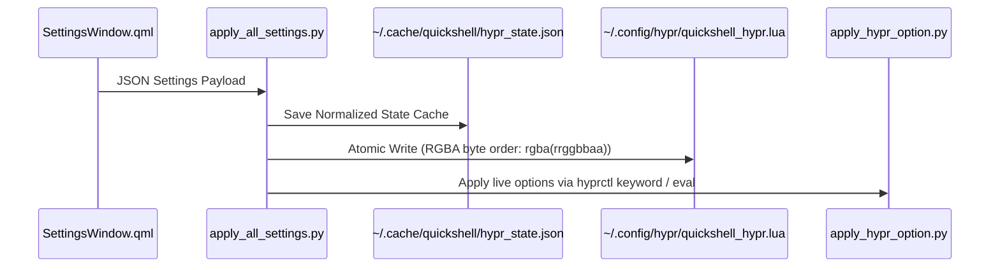

# QuickShell Notch — System Architecture Specification (v2.4.0)

This document provides a comprehensive technical reference for the architecture, component topology, data flows, persistence pipelines, and lifecycle models of the **QuickShell Notch** desktop shell for Hyprland.

---

## 1. System Overview

QuickShell Notch is an expressive, hardware-integrated desktop status bar and interactive dynamic island for the **Hyprland Wayland Compositor**. Built on **QuickShell (Qt6 / QML)** and backed by asynchronous Python and POSIX shell daemons, it combines lightweight resource utilization with fluid spring-physics animations.

```mermaid
graph TD
    subgraph Wayland["Wayland Compositor & Hyprland"]
        HL["Hyprland IPC Socket"]
        DBus["D-Bus Session Bus"]
        SysFS["Linux /proc & /sys"]
    end

    subgraph ShellSurface["QuickShell Runtime (shell.qml)"]
        LayerShell["LayerShell Top Panel Surface"]
        NotifServer["Notification Server Daemon"]
        IPCSocket["/tmp/quickshell-notch.sock"]
        Notch["TopNotch.qml (Orchestrator)"]
    end

    subgraph Decomposed["Modular QML Sub-Components"]
        CompactPill["CompactPill.qml (Collapsed State)"]
        MediaCtrl["MediaController.qml (MPRIS & Sliders)"]
        OSD["OsdOverlay.qml (Vol/Bri Popup)"]
        StatusBar["StatusBar.qml (Header & Battery)"]
        Stats["HardwareStats.qml (Resource Gauges)"]
    end

    subgraph Overlays["Drawer & Tab Overlays"]
        Apps["AppLauncher.qml (Page 1)"]
        Walls["WallpaperSelector.qml (Page 2)"]
        Audio["AudioMenu.qml (Audio Drawer)"]
        Wifi["WifiMenu.qml"]
        BT["BluetoothMenu.qml"]
        Power["PowerMenu.qml"]
        Notifs["NotificationHistory.qml"]
        Settings["SettingsWindow.qml"]
    end

    subgraph Backends["Asynchronous Python Backends"]
        CAVA["stream_audio_visualizer.py"]
        DevLevels["get_device_levels.py"]
        SysInfo["get_system_info.py"]
        AppScanner["get_apps.py"]
        WallScanner["scan_wallpapers.py"]
        AudioBackend["manage_audio.py"]
        WifiBackend["manage_wifi.py"]
        BTBackend["manage_bluetooth.py"]
        DualWrite["apply_all_settings.py"]
    end

    LayerShell --> Notch
    IPCSocket --> Notch
    NotifServer --> Notifs
    Notch --> CompactPill
    Notch --> MediaCtrl
    Notch --> OSD
    Notch --> StatusBar
    Notch --> Stats
    Notch --> Apps
    Notch --> Walls
    Notch --> Audio
    Notch --> Wifi
    Notch --> BT
    Notch --> Power
    Notch --> Notifs
    Notch --> Settings

    CompactPill -.-> CAVA
    MediaCtrl -.-> CAVA
    Stats -.-> SysInfo
    StatusBar -.-> DevLevels
    Apps -.-> AppScanner
    Walls -.-> WallScanner
    Audio -.-> AudioBackend
    Wifi -.-> WifiBackend
    BT -.-> BTBackend
    Settings -.-> DualWrite
    DualWrite --> HL
```



---

## 2. Directory Structure

```
~/.config/quickshell/
├── shell.qml                     # Wayland LayerShell root surface, IPC server, NotificationServer
├── components/                   # Modular QML UI Components
│   ├── TopNotch.qml              # High-level orchestrator & geometry morphing state machine
│   ├── CompactPill.qml           # Collapsed notch: clock, workspace dots, CAVA visualizer
│   ├── MediaController.qml       # PAGE 0: MPRIS media controls, circular visualizer, volume/mic
│   ├── AppLauncher.qml           # PAGE 1: Application grid, fuzzy search, .desktop launcher
│   ├── WallpaperSelector.qml     # PAGE 2: Wallpaper grid, thumbnail cache, search filter
│   ├── HardwareStats.qml         # PAGE 3: CPU/RAM/Disk/Network realtime sparkline gauges
│   ├── StatusBar.qml             # Expanded header row, segmented tab switcher, iOS battery capsule
│   ├── OsdOverlay.qml            # Volume/brightness OSD popup with rotating icon impulse
│   ├── AudioMenu.qml             # PipeWire sink/source audio routing drawer
│   ├── WifiMenu.qml              # Wi-Fi network scanner and connection drawer
│   ├── BluetoothMenu.qml         # Bluetooth device manager drawer
│   ├── PowerMenu.qml             # Power actions (lock, logout, suspend, reboot, shutdown)
│   ├── NotificationHistory.qml   # Persistent notification center drawer
│   ├── SettingsWindow.qml        # Dedicated GUI settings window (Hyprland + Notch prefs)
│   ├── CustomSlider.qml          # Material 3 pill slider with spring feedback
│   ├── CustomSwitch.qml          # Material 3 toggle switch
│   ├── M3Icon.qml                # Vector SVG icon renderer with color overlays
│   └── SparklineCanvas.qml       # 2D Canvas anti-aliased gradient chart
├── theme/
│   └── Style.qml                 # Centralized design tokens (colors, typography, spring physics)
├── scripts/
│   ├── core/                     # Lifecycle, process safety, and validation tools
│   │   ├── atomic_write.py       # Crash-resilient file write helper
│   │   ├── process_utils.py      # Linux PR_SET_PDEATHSIG child process reaper
│   │   ├── test_all_features.py  # 195-test automated test harness
│   │   ├── test_mpris_seek.py    # Exhaustive verification suite for MPRIS seeking engine
│   │   ├── validate_codebase.sh  # QML lint + Python compile + Bash AST validator
│   │   ├── launch_quickshell.sh  # Clean daemon launcher with process reaper
│   │   ├── sandbox.sh            # Isolated test environment launcher
│   │   ├── osd.sh                # Volume/brightness OSD helper
│   │   ├── download_macos_fonts.sh # Apple SF Pro & SF Mono font downloader
│   │   ├── download_macos_icons.sh # Apple macOS SF Symbols SVGs downloader
│   │   └── download_m3_icons.sh  # Legacy redirect to download_macos_icons.sh
│   ├── desktop/                  # Desktop metadata providers
│   │   ├── apply_wallpaper.sh    # Non-blocking wallpaper changer with wallust trigger
│   │   ├── get_apps.py           # .desktop parser with icon heuristic resolver
│   │   ├── get_device_levels.py  # Audio (wpctl), brightness, battery sysfs poller
│   │   ├── get_system_info.py    # Zero-dependency /proc parser (CPU, RAM, Disk, Net)
│   │   ├── get_wallust_colors.sh # Wallust accent color reader
│   │   ├── manage_audio.py       # PipeWire / WirePlumber audio stream & device manager
│   │   └── scan_wallpapers.py    # Multi-threaded image scanner & thumbnailer
│   ├── hyprland/                 # Hyprland integration & persistence
│   │   ├── apply_all_settings.py # Atomic dual-write settings applier
│   │   ├── apply_hypr_option.py  # Live hyprctl option applier (Lua / Conf tolerant)
│   │   ├── get_hypr_options.py   # Batch reader for active Hyprland options
│   │   ├── hypr_keymap.py        # Single source of truth for Hyprland option keys
│   │   ├── persist_hypr_state.py # Lua and Conf config syntax generator
│   │   └── set_hypr_option.sh    # Single option persistence CLI shim
│   ├── network/                  # Network management backends
│   │   ├── manage_bluetooth.py   # bluetoothctl device controller
│   │   └── manage_wifi.py        # nmcli Wi-Fi controller
│   └── notch/                    # Notch IPC, preferences, and visualizer daemons
│       ├── notch_ipc.py          # IPC socket client (keybind commands)
│       ├── get_notch_settings.py # Notch preferences loader and defaults store
│       ├── stream_audio_visualizer.py # CAVA child -> JSON stream (pdeathsig)
│       ├── mpris_duration.py     # Multi-tier track duration resolver with caching
│       └── mpris_seek.py         # Atomic MPRIS seek engine with D-Bus / playerctl fallback
├── packaging/                     # Arch Linux PKGBUILD and packaging files
├── templates/
│   └── matugen/                   # Matugen config & 11 Material You templates
├── assets/
│   ├── icons/                    # Official Apple macOS SF Symbols SVGs
│   └── fonts/                    # Apple SF Pro & SF Mono system typography
└── notch_settings.json           # Runtime notch preferences
```

---

## 3. Subsystem Deep-Dive

### 3.1 Orchestration & State Machine (`TopNotch.qml`)
`TopNotch.qml` acts as the root orchestrator. It manages:
- **Geometry State Machine**:
  - Compact Pill: `130px - 420px` width (dynamically stretched by audio track title width or workspace count), `30px` height.
  - Expanded Island: `560px` width, dynamically calculated height (`pageNotchHeight`) based on active tab content.
  - Inverted Dripping Ears: 2D Canvas arcs attached to the top-left and top-right of the notch box for continuous bezel styling.
- **Navigation Lifecycle**:
  - `currentPage`: 0 (Media), 1 (Apps), 2 (Walls), 3 (Stats).
  - Lazy Tab Loading: App launcher and Wallpaper tabs are dynamically activated and unloaded after 5 seconds of inactivity to conserve memory.

### 3.2 Pure Lua Hyprland Persistence Pipeline
Hyprland configuration is managed purely using modern Lua configuration architecture. QuickShell Notch guarantees clean, type-safe settings persistence by executing atomic writes into `quickshell_hypr.lua`:



### 3.3 Child Process Lifecycle & Safety (`PR_SET_PDEATHSIG`)
To prevent orphan child processes (e.g., `cava`, `bluetoothctl`, `nmcli monitor`) from leaking CPU when QuickShell is killed or reloaded, all background Python daemons import `set_pdeathsig()` from `scripts/core/process_utils.py`. This leverages the Linux kernel's `prctl(PR_SET_PDEATHSIG, SIGTERM)` so child processes terminate instantly upon parent death.

### 3.4 IPC Socket Interface (`/tmp/quickshell-notch.sock`)
The shell listens on a local Unix Domain Socket for fast keybind integration:

| Command | Action |
|---|---|
| `toggle` | Toggle between compact pill and expanded island |
| `close` | Immediately collapse notch and close all open sub-menus |
| `nook` | Toggle directly to the Media Controller / NotchNook tab (PAGE 0) |
| `apps` / `tray` | Toggle directly to the App Launcher tab (PAGE 1) |
| `walls` | Toggle directly to the Wallpaper Selector tab (PAGE 2) |
| `stats` | Toggle directly to the Hardware Stats tab (PAGE 3) |
| `tab:<0-3>` | Direct switch to tab index (0: Media, 1: Apps, 2: Wallpapers, 3: Stats) |
| `audio` | Toggle Audio Routing Drawer |
| `notifs` | Toggle Notification History Drawer |
| `notifs:clear` | Clear active notifications with staggered 180ms card dismissal |
| `wifi` | Toggle Wi-Fi Network Drawer |
| `bluetooth` / `bt` | Toggle Bluetooth Device Drawer |
| `settings` | Toggle Settings Window |
| `settings:tab:<0-3>` | Open Settings Window directly to tab index (0: Hyprland, 1: Notch Island, 2: Visualizer, 3: System & Apps) |
| `osd:vol:<0-150>` | Display Volume OSD with percentage and icon animation |
| `osd:bri:<0-100>` | Display Brightness OSD with ±45° rotating sun/moon impulse |
| `reload_settings` | Reload notch preferences from disk without restart |

---

## 4. Design System & Tokens (`theme/Style.qml`)

QuickShell Notch implements the **macOS NotchNook UI** design language with Apple SF Symbols:
- **Surfaces**: Pure OLED black (`#000000`) root with elevated card containers (`#1C1C1E`) and subtle borders (`#2C2C2E`).
- **Dynamic Accent**: Matugen 4.2.0 (Material You CAM16 palette generation with 11 custom templates) and Wallust compatibility automatically synchronized with the active wallpaper.
- **iOS Semantic Battery**: Charging (`#30D158`), Normal (`#FFFFFF`), Low Power (`#FFD60A`), Critical (`#FF453A`).
- **Physics**: Unified single-body spring scaling and calibrated tab bounce physics ($4.5/0.30$ spring, `springPageEpsilon: 0.0005`, zero end-of-transition snap) driving geometry morphing, tab highlights, and icon impulses.

---

## 5. Development & Verification

### Codebase Validation
```bash
~/.config/quickshell/scripts/core/validate_codebase.sh
```
Checks QML syntax (`qmllint`), Python syntax (`py_compile`), and Bash scripts (`bash -n`).

### Automated Test Suite
```bash
python3 ~/.config/quickshell/scripts/core/test_all_features.py
```
Runs 195 automated tests across 15 modules in an isolated temporary sandbox.
