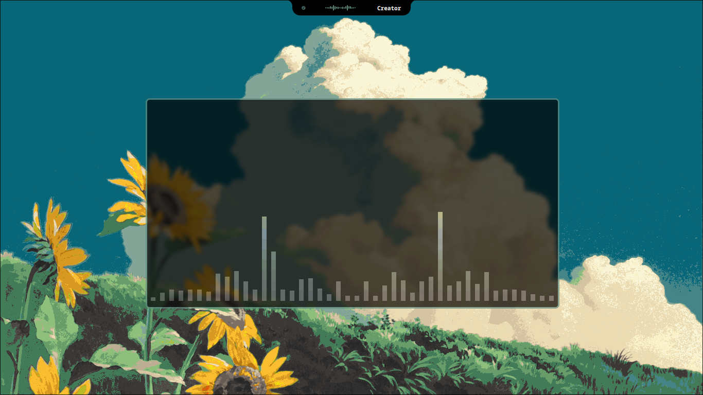
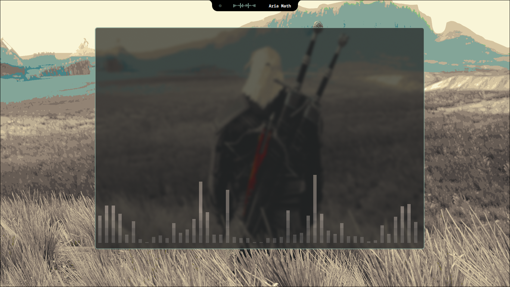

# QuickShell Top Notch

A customized, high-performance desktop status bar and control center built with QuickShell, styled with Wallust accent colors, and integrated with Hyprland and SwayNC.

Top Notch morphs dynamically between a compact top-center status pill and an expanded, tabbed system control dashboard.

## Showcase

### Dynamic Dashboard


### Widget Integrations


### Video Demo
<video src="assets/notch_demo.mp4" width="100%" controls="controls"></video>

---

## Features

- **Dynamic Pill Morphing**: Morphs smoothly using spring physics between compact, expanded, and power menu states.
- **Hardware Stats Dashboard**: Real-time graphs for CPU and RAM load utilizing custom HTML5 Canvas paths, alongside disk storage tracking. Polling interval is customizable in settings and sleeps when the tab is closed (0% idle overhead).
- **MPRIS Media Controller**: Fully functional music controller displaying dynamic track album art, seek-enabled elapsed timeline slider, volume controls, and metadata.
- **Fast App Launcher**: Desktop application scanner equipped with icon path matching and flatpak walk-pruning. Caches results and automatically re-scans when new packages are installed or removed.
- **Wallpaper Selector**: Dynamic grid selector generating high-quality thumbnails in parallel across CPU cores. Sets the active desktop background via `awww` with Wallust palette transitions.
- **SwayNC Notification Panel**: Customized notification widget styled to align with the dark-card aesthetic of the notch.
- **Settings Controller**: Comprehensive settings configuration manager to adjust animation physics, visualizer styles, and hardware stats polling rates.

---

## Directory Structure

```
~/.config/quickshell/
├── shell.qml                   # Main entry point (Window and grab definition)
├── README.md                   # Project documentation
├── AGENTS.md                   # AI developer handbook
├── components/                 # QML layouts and tabs
│   ├── TopNotch.qml            # Primary notch logic, media, stats, visualizer
│   ├── WallpaperSelector.qml   # Wallpaper grid selector (FocusScope)
│   ├── AppLauncher.qml         # App grid launcher with fast cache matching
│   ├── SettingsWindow.qml      # Configuration option panel
│   ├── CustomSlider.qml        # Styled sliding controller
│   └── CustomSwitch.qml        # Styled toggle switch
├── scripts/                    # Python and Shell system integration helpers
│   ├── launch_quickshell.sh    # Relaunches QuickShell cleanly
│   ├── apply_all_settings.py   # Synchronizes settings to Lua and Conf configs
│   ├── get_system_info.py      # Reads CPU, RAM, and disk metrics
│   ├── get_hypr_options.py     # Queries Hyprland active properties
│   ├── scan_wallpapers.py      # Generates wallpaper thumbnails in parallel
│   └── stream_audio_visualizer.py  # CAVA audio visualizer stream pipe
└── theme/                      # Styling definitions
    └── Style.qml               # Global colors, margins, and radii
```

---

## Installation (Arch Linux)

### 1. Install System Dependencies
The notch relies on a suite of modern Wayland tools, Python libraries, and audio/color parsers. Install them via your package manager and AUR helper (e.g., `paru` or `yay`):

```bash
# Core Wayland & UI dependencies
sudo pacman -S swaync playerctl socat dbus
yay -S quickshell-git awww wallust-bin cava

# Python backend dependencies
sudo pacman -S python-pillow python-gobject

# Fonts (Required for UI Glyphs and Clock formatting)
sudo pacman -S ttf-jetbrains-mono-nerd ttf-ubuntu-font-family
```

### 2. Wallust Configuration (Color Themes)
This notch dynamically themes itself based on your wallpaper using `wallust`. It expects a valid Wallust configuration that generates `colors.sh`.
- Ensure your `~/.config/wallust/wallust.toml` is configured to export the `shell-colors` template to `~/.cache/wal/colors.sh`.

### 3. Clone the Configuration
Clone this repository directly into your configuration directory:

```bash
git clone https://github.com/YogeshKumar14/quickshell-notch.git ~/.config/quickshell
```

### 4. Integrate with Hyprland
To load Top Notch automatically when Hyprland starts, add the launcher script to your startup configuration.

For **Lua configurations** (`hyprland.lua`):
```lua
hl.on("hyprland.start", function()
    hl.exec_cmd("$HOME/.config/quickshell/scripts/core/launch_quickshell.sh")
end)
```

For **Standard configurations** (`hyprland.conf`):
```ini
exec-once = bash ~/.config/quickshell/scripts/core/launch_quickshell.sh
```

---

## Dynamic Settings Persistence
This bar writes user configuration overrides dynamically to both:
- `~/.config/hypr/quickshell_hypr.lua`
- `~/.config/hypr/quickshell_hypr.conf`

Ensure these files are imported/sourced inside your main Hyprland configuration to persist options (like window border sizes, rounding, shadows, and gaps) across restarts.

---

## License

This project is licensed under the MIT License - see the LICENSE details below.

```
MIT License

Copyright (c) 2026 Yogesh Kumar

Permission is hereby granted, free of charge, to any person obtaining a copy
of this software and associated documentation files (the "Software"), to deal
in the Software without restriction, including without limitation the rights
to use, copy, modify, merge, publish, distribute, sublicense, and/or sell
copies of the Software, and to permit persons to whom the Software is
furnished to do so, subject to the following conditions:

The above copyright notice and this permission notice shall be included in all
copies or substantial portions of the Software.

THE SOFTWARE IS PROVIDED "AS IS", WITHOUT WARRANTY OF ANY KIND, EXPRESS OR
IMPLIED, INCLUDING BUT NOT LIMITED TO THE WARRANTIES OF MERCHANTABILITY,
FITNESS FOR A PARTICULAR PURPOSE AND NONINFRINGEMENT. IN NO EVENT SHALL THE
AUTHORS OR COPYRIGHT HOLDERS BE LIABLE FOR ANY CLAIM, DAMAGES OR OTHER
LIABILITY, WHETHER IN AN ACTION OF CONTRACT, TORT OR OTHERWISE, ARISING FROM,
OUT OF OR IN CONNECTION WITH THE SOFTWARE OR THE USE OR OTHER DEALINGS IN THE
SOFTWARE.
```
